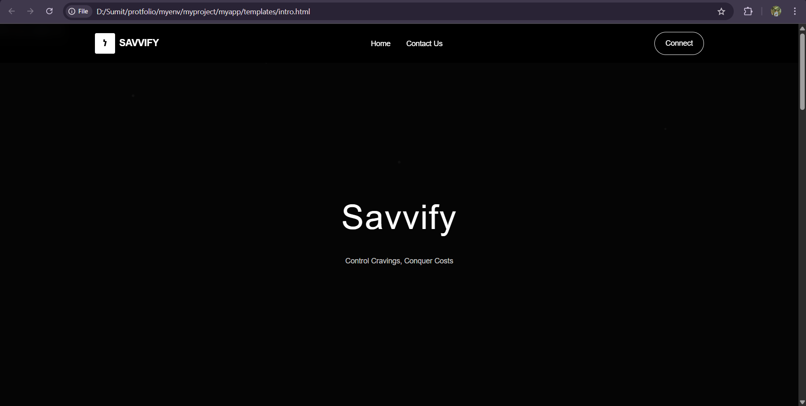
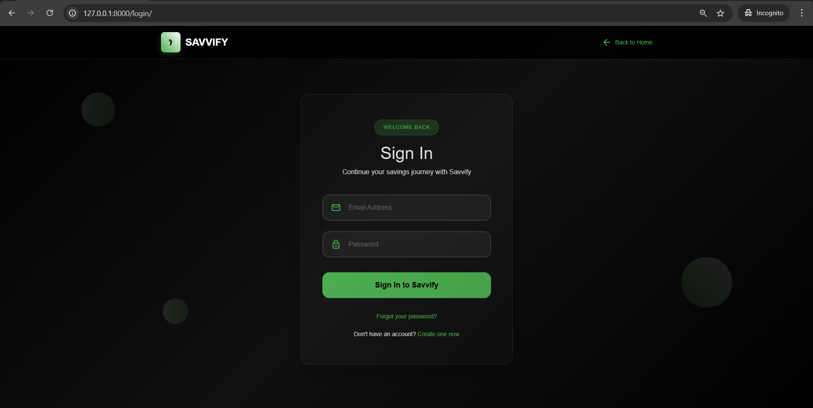
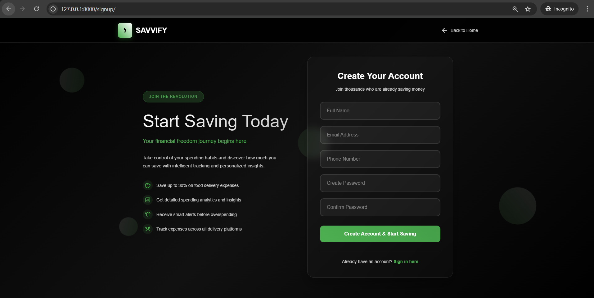
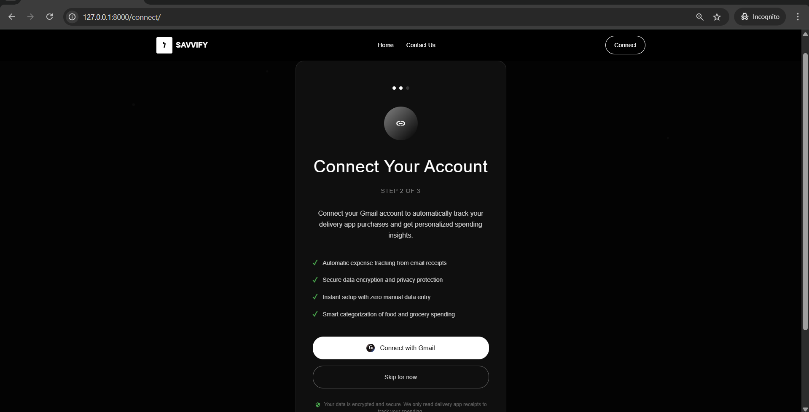
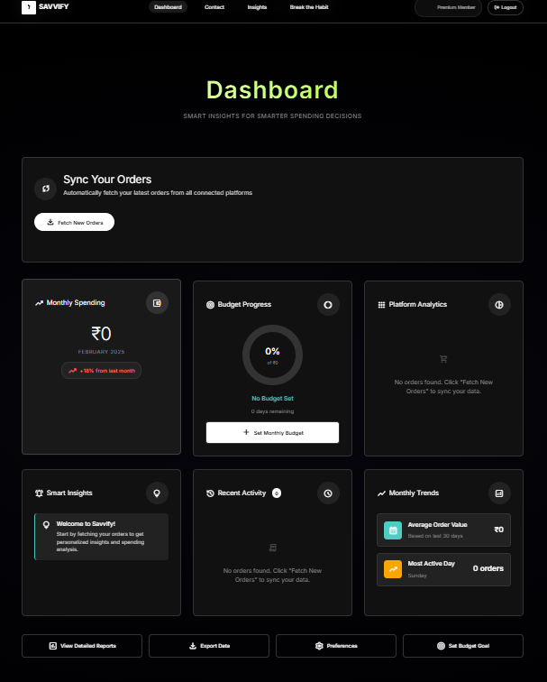

# Savvify 🍽️💰

> Track and control your spending on popular Indian food delivery and grocery apps

Savvify is a Django + Python web application designed to help users monitor and manage their expenses across popular Indian food delivery and grocery platforms including Swiggy, Zomato, Zepto, Blinkit, and BigBasket.

## 🚀 Features

- **Modern Dark UI**: Professional dark theme with green accent colors
- **Automated Order Fetching**: Automatically fetch order details from your email using OAuth authentication
- **Comprehensive Dashboard**: Real-time spending insights with interactive widgets
- **Multi-Platform Tracking**: Monitor spending across Swiggy, Zomato, Zepto, Blinkit, and BigBasket
- **Progressive Onboarding**: 3-step user setup process for seamless account creation
- **Budget Management**: Set monthly/weekly spending limits with visual progress tracking
- **Smart Analytics**: Detailed spending breakdowns with monthly trends and platform analytics
- **Security-First Approach**: OAuth 2.0 authentication with clear privacy messaging

## 🛠️ Tech Stack

- **Backend**: Django 4.x
- **Language**: Python 3.8+
- **Email Integration**: OAuth 2.0 (Gmail API / IMAP)
- **Email Processing**: Python email parsing libraries
- **Database**: SQLite (development) / PostgreSQL (production)
- **Frontend**: HTML5, CSS3, JavaScript
- **Styling**: Bootstrap 5
- **Charts**: Chart.js for data visualization

## 📋 Prerequisites

Before you begin, ensure you have the following installed:
- Python 3.8 or higher
- pip (Python package installer)
- Git

## ⚡ Quick Start

### 1. Clone the Repository
```bash
git clone https://github.com/SumitBiniYadav/Savvify-.git
cd Savvify-
```

### 2. Create Virtual Environment
```bash
# Create virtual environment
python -m venv savvify_env

# Activate virtual environment
# On Windows
savvify_env\Scripts\activate
# On macOS/Linux
source savvify_env/bin/activate
```

### 3. Install Dependencies
```bash
pip install -r requirements.txt
```

### 4. Database Setup
```bash
# Run migrations
python manage.py makemigrations
python manage.py migrate

# Create superuser (optional)
python manage.py createsuperuser
```

### 5. Run Development Server
```bash
python manage.py runserver
```

Visit `http://127.0.0.1:8000` in your browser to access the application.

## 🚀 Getting Started Guide

### First Time Setup
1. **Create Account**: Sign up with your details on the registration page
2. **Connect Gmail**: Link your Gmail account using secure OAuth 2.0 authentication  
3. **Automatic Sync**: Let Savvify automatically fetch and categorize your delivery orders
4. **Set Budgets**: Configure monthly spending limits for different platforms
5. **View Dashboard**: Monitor your spending patterns and analytics

## 📁 Project Structure

```
Savvify-/
├── savvify/                # Main project directory
│   ├── settings.py         # Django settings
│   ├── urls.py            # URL configuration
│   └── wsgi.py            # WSGI configuration
├── apps/                  # Application modules
│   ├── tracking/          # Expense tracking app
│   ├── analytics/         # Data analytics app
│   ├── email_integration/ # OAuth email fetching
│   └── users/             # User management app
├── static/                # Static files (CSS, JS, images)
├── templates/             # HTML templates
├── media/                 # User uploaded files
├── requirements.txt       # Python dependencies
├── manage.py             # Django management script
└── README.md             # Project documentation
```

## 💡 Usage

### Adding Spending Data
1. **OAuth Email Connection**: Connect your email account (Gmail recommended) using secure OAuth 2.0
2. **Automatic Order Detection**: The system automatically scans your email for order confirmations
3. **Manual Entry**: Add individual orders manually if needed
4. **Email Pattern Recognition**: Automatically identifies orders from Swiggy, Zomato, Zepto, Blinkit, and BigBasket emails

### Email Integration Setup
1. Navigate to Settings → Email Integration
2. Click "Connect Email Account"
3. Authorize access through OAuth (Gmail/other providers)
4. Select date range for initial email scan
5. Let the system automatically fetch and categorize your orders

### Setting Budgets
1. Navigate to Budget Settings
2. Set monthly or weekly spending limits
3. Choose which platforms to include
4. Enable notifications for budget alerts

### Dashboard Features
- **Spending Overview**: Current month spending with percentage change indicators
- **Budget Progress**: Visual progress bars showing budget utilization
- **Platform Analytics**: Individual spending breakdown by delivery platform
- **Smart Insights**: AI-powered recommendations for spending optimization  
- **Recent Activity**: Latest order tracking and categorization
- **Monthly Trends**: Historical spending patterns and forecasting
- **Order Sync**: "Fetch New Orders" button for manual sync when needed

## 🔧 Configuration

### OAuth & Email Configuration
Create a `.env` file in the root directory:
```env
SECRET_KEY=your-secret-key-here
DEBUG=True
DATABASE_URL=sqlite:///db.sqlite3
ALLOWED_HOSTS=localhost,127.0.0.1

# Gmail OAuth Configuration
GMAIL_CLIENT_ID=your-gmail-client-id
GMAIL_CLIENT_SECRET=your-gmail-client-secret
GMAIL_REDIRECT_URI=http://localhost:8000/auth/callback

# Other Email Providers (optional)
OUTLOOK_CLIENT_ID=your-outlook-client-id
OUTLOOK_CLIENT_SECRET=your-outlook-client-secret
```

### Gmail API Setup
1. Go to [Google Cloud Console](https://console.cloud.google.com/)
2. Create a new project or select existing one
3. Enable Gmail API
4. Create OAuth 2.0 credentials
5. Add authorized redirect URIs: `http://localhost:8000/auth/callback`
6. Download credentials and add to your `.env` file

## 🔐 Security & Privacy

**Email Access**: 
- Uses secure OAuth 2.0 authentication
- No email passwords are stored
- Only reads email metadata and order confirmation emails
- Users can revoke access at any time
- Email data is processed locally and not shared with third parties

## 📊 Supported Platforms
- All sensitive data is encrypted
- OAuth tokens are securely stored
- Regular security audits and updates

| Platform | Email Recognition | OAuth Integration | Manual Entry |
|----------|------------------|-------------------|--------------|
| Swiggy   | ✅ Auto-detect   | ✅ Gmail/Outlook  | ✅           |
| Zomato   | ✅ Auto-detect   | ✅ Gmail/Outlook  | ✅           |
| Zepto    | ✅ Auto-detect   | ✅ Gmail/Outlook  | ✅           |
| Blinkit  | ✅ Auto-detect   | ✅ Gmail/Outlook  | ✅           |
| BigBasket| ✅ Auto-detect   | ✅ Gmail/Outlook  | ✅           |

## 🧪 Testing

Run the test suite:
```bash
python manage.py test
```

Run specific app tests:
```bash
python manage.py test apps.tracking
```

Roadmap

- [ ] Mobile app development (React Native)
- [ ] Advanced analytics with ML insights
- [ ] Budget optimization suggestions
- [ ] Social spending comparison features
- [ ] Support for more email providers (Yahoo, Outlook, etc.)
- [ ] Advanced email parsing with ML for better accuracy
- [ ] Real-time email notifications for new orders
- [ ] Expense categorization with AI
- [ ] Automated recurring budget alerts

## 🤝 Contributing

We welcome contributions! Please follow these steps:

1. Fork the repository
2. Create a feature branch: `git checkout -b feature-name`
3. Make your changes and commit: `git commit -m 'Add feature'`
4. Push to the branch: `git push origin feature-name`
5. Submit a pull request

### Development Guidelines
- Follow PEP 8 style guidelines
- Write tests for new features
- Update documentation as needed
- Use meaningful commit messages


## 👨‍💻 Author

**Sumit Bini Yadav**
- GitHub: [@SumitBiniYadav](https://github.com/SumitBiniYadav)
- LinkedIn: [Your LinkedIn Profile]

## 🙏 Acknowledgments

- Thanks to the Django community for excellent documentation
- Inspiration from various spending tracker applications
- Contributors and testers who helped improve the project

## 📱 Screenshots

### Landing Page

*Clean, minimalist landing page with "Control Cravings, Conquer Costs" tagline*

### Authentication
 
*Secure user authentication with beautiful dark theme*

### Gmail Integration

*Step 2 of 3: Connect Gmail account for automatic order tracking with security features highlighted*

### Dashboard Overview

*Comprehensive dashboard with spending insights, budget tracking, and platform analytics*

## 🎨 UI/UX Features

- **Dark Theme**: Modern dark UI with green accent colors
- **Responsive Design**: Clean, professional interface optimized for all devices
- **Progressive Onboarding**: 3-step setup process for new users
- **Visual Analytics**: Card-based layout with spending widgets and charts
- **Security First**: Clear privacy messaging throughout the user journey

---

⭐ **Star this repository if you find it helpful!** ⭐
